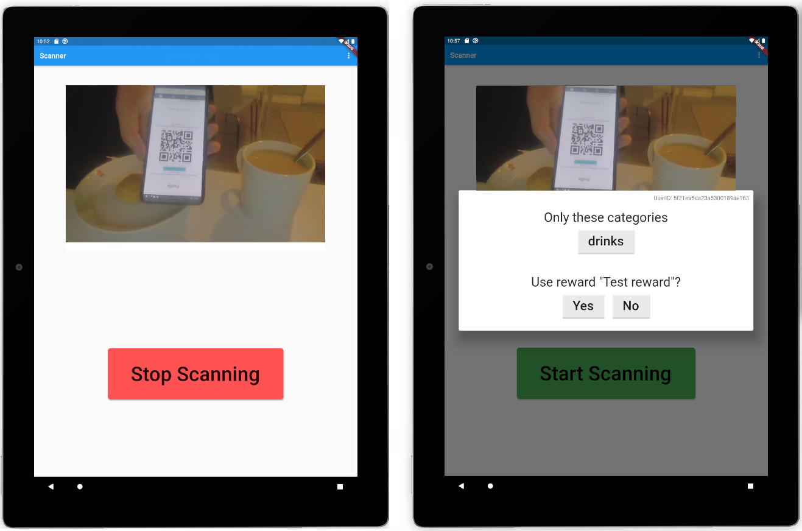

# easy-loyalty-app
Loyalty app setup with (progressive web) app, backend, management panel and a scanner app.

The solution for building versatile loyalty apps easier with a WYSIWYG editor ([grapesjs](https://grapesjs.com/)).

This documentation will be updated later. Also, the entire project is still under development.

## Features

- Customizable pages ([grapesjs](https://grapesjs.com/) editor or raw HTML/CSS)
- Customizable [app](../loyalty-app) and app settings
- Versatile campaigns: stamps, birthday and custom campaigns and [more](../loyalty-campaigns)
- Customer rewards
- Customer levels with rewards
- QR codes in the app to identify the customer and reward
- QR code reader app ([scanner-app](../scanner-app))
- Progressive web app (e.g add to home screen)
- Push notifications

...and more

## Start development
Prerequisites: [docker](https://docs.docker.com/engine/install/) and [docker-compose](https://docs.docker.com/compose/install/)

Run the `start-dev.sh` script to start the development environment.  
You can run each service manually as well. In that case, you must install requirements (such as NPM, Yarn and MongoDB) manually.

## loyalty-panel
The control/management panel (https://panel.getloyalty.app). The place where you create the campaigns, pages etc.

Default development port: [3002](http://localhost:3002) 

## loyalty-app
The web app (PWA) the users/customers will use. You can see the pages, on going campaigns, your rewards and more here.

Default development port: [3000](http://localhost:3000) 

* The screenshots are from the beta version. 
The pages are already a lot better and you can easily edit them.

## scanner-app
A simple app to scan customer QR codes and confirm purchases and rewards.

## loyalty-backend
The backend of the loyalty app (one per app). Uses MongoDB as the database for users, campaigns, pages etc.

Default development port: [3001](http://localhost:3001) 

See [here](./assets) for more images.